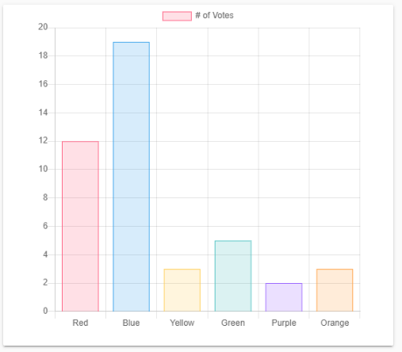
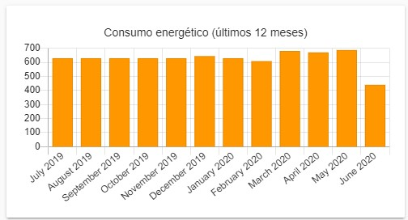

# chartjs-card
Chart.js card for Home Assistant



## Instalation through HACS
This card isn't in HACS, but you can add it manually through `Custom repositories`

To do that just follow these steps: **HACS -> Frontend -> 3 dots (upper right corner) -> Custom repositories -> (Paste this github page url)**

## Config
| Name           | Type     | Default     | Description |
| -------------- | -------- | ----------- |------------ |
| chart          | string   |             | chart type  |
| data           |          |             | just like chart.js documentation |
| options        |          |             | just like chart.js documentation |
| entitiy_row    | boolean  | false       | if is entity row or not |
| custom_options | object   |             | TODO |

[Chart.js documentation](https://www.chartjs.org/docs/latest/)

### example

```yaml
type: 'custom:chartjs-card'
chart: bar # Supports: ['line', 'radar', 'bar', 'horizontalBar', 'pie', 'doughnut', 'polarArea', 'bubble', 'scatter']
custom_options:
  showLegend: false
data: # everything inside represent the data to the chart like Chart.js docs
  datasets:
    - backgroundColor: var(--accent-color)
      borderWidth: 1
      data: '${states["sensor.energy_last_12_months"].attributes.data}' # ["650", "630", .... ]
      label: Eletricidade
  labels: '${states["sensor.energy_last_12_months"].attributes.labels}' # ["july", "august", .... ]
entity_row: false
options: # Same applies here like data above
  title:
    display: true
    text: Consumo energético (últimos 12 meses)
  scales:
    yAxes:
      - ticks:
          beginAtZero: true
```